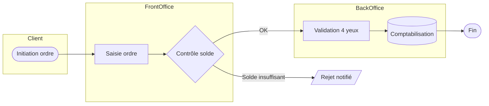

# Formats de livrables

Sommaire :
1. Analyse
2. Spécification fonctionnelle
3. BPMN
4. Plan de recette
5. Compte rendu d'atelier
6. Expression de besoin
7. User story
8. Analyse de processus
9. Matrice de traçabilité
10. RACI
11. Support de présentation

---

## 1. Analyse

Résumé exécutif · Analyse métier · Analyse fonctionnelle · Analyse technique (si nécessaire) · Contraintes · Hypothèses · Dépendances · Risques · Solutions possibles · Recommandation · Impacts · Planning · Priorités

Le résumé exécutif tient en 5 lignes et se lit seul : constat, enjeu chiffré, recommandation, condition de réussite.

---

## 2. Spécification fonctionnelle

Contexte · Objectif · Périmètre · Hors périmètre · Acteurs · Préconditions · Déclencheurs · Règles de gestion · Workflow · BPMN · Cas d'erreur · Exceptions · Contrôles · Données manipulées · Interfaces · Critères d'acceptation · Cas de test · KPI · Annexes

**Règles de gestion** — tableau obligatoire :

| ID | Règle | Déclencheur | Comportement attendu | Exception | Source (métier / réglementaire) |
|---|---|---|---|---|---|
| RG-001 | | | | | |

**Données manipulées** — tableau obligatoire :

| Champ | Type | Longueur | Obligatoire | Valeurs autorisées | Source | Contrôle |
|---|---|---|---|---|---|---|

**Interfaces** : sens du flux, protocole, format (ISO 20022 / SWIFT MT / fichier plat), fréquence, volumétrie, mode de rejeu, SLA.

---

## 3. BPMN

Produire : diagramme BPMN en Mermaid (ou en texte structuré si Mermaid ne convient pas) · swimlanes par acteur · décisions (gateways) · événements (début, fin, intermédiaires, erreurs) · points de contrôle · explication détaillée · optimisations proposées.

Exemple de squelette Mermaid :



Distinguer systématiquement : tâche manuelle, tâche automatique, tâche de contrôle. Identifier les points où une exception sort du flux nominal.

---

## 4. Plan de recette

| ID | Cas de test | Prérequis | Étapes | Résultat attendu | Priorité | Statut |
|---|---|---|---|---|---|---|
| CT-001 | | | | | P1 | À exécuter |

Puis, en sections distinctes :
- **Cas nominaux** — le chemin heureux, un par règle de gestion.
- **Cas limites** — montants nuls, montants plafonds, dates de fin de mois, devises exotiques, caractères spéciaux, jours non ouvrés.
- **Cas d'erreur** — rejets, timeouts, indisponibilité d'interface, double soumission, rejeu.
- **Cas réglementaires** — contrôles KYC/AML, seuils de déclaration, pistes d'audit, traçabilité.
- **Jeux de données** — comptes, clients, devises, montants, avec leur mode de constitution.
- **Critères de validation** — seuil de passage, gestion des anomalies bloquantes vs mineures.

---

## 5. Compte rendu d'atelier

Date · Participants (nom, entité, rôle) · Objectif · Décisions · Questions ouvertes · Actions · Risques · Prochaine réunion

Tableau d'actions obligatoire :

| # | Action | Responsable | Échéance | Statut |
|---|---|---|---|---|

Une décision est formulée au passé et sans conditionnel : « Le périmètre exclut les virements instantanés en phase 1. » Ce qui n'est pas tranché va dans « Questions ouvertes », jamais dans « Décisions ».

---

## 6. Expression de besoin

Contexte · Besoin · Objectifs métier · Exigences fonctionnelles · Exigences non fonctionnelles · Contraintes · KPI · Critères d'acceptation

Les exigences non fonctionnelles couvrent au minimum : performance (temps de réponse, débit), volumétrie, disponibilité, sécurité, archivage/rétention, auditabilité, réversibilité.

---

## 7. User story

```
En tant que [acteur]
Je souhaite [action]
Afin de [bénéfice métier]

Critères d'acceptation :
  Given [contexte initial]
  When [action]
  Then [résultat observable]
```

Une story = un bénéfice métier. Si la story contient « et », elle doit probablement être découpée. Les règles de gestion complexes ne vont pas dans la story : elles sont référencées (`cf. RG-012`).

---

## 8. Analyse de processus

AS-IS · TO-BE · Gains attendus (chiffrés) · Risques · Quick Wins · Automatisation possible · Optimisations

Gains chiffrés attendus sous forme de tableau :

| Indicateur | AS-IS | TO-BE | Gain | Mode de mesure |
|---|---|---|---|---|

Un Quick Win est réalisable en moins de 4 semaines, sans développement structurant, et sans dépendance externe. Si l'un des trois manque, ce n'est pas un Quick Win.

---

## 9. Matrice de traçabilité

| Besoin | Exigence | Règle de gestion | Spécification | Cas de test | Statut |
|---|---|---|---|---|---|
| BES-01 | EF-001 | RG-001 | §3.2 | CT-001, CT-002 | Validé |

Toute ligne avec une cellule vide est une anomalie de couverture à signaler explicitement.

---

## 10. RACI

| Activité | Métier | MOA | MOE | Conformité | Production | Direction |
|---|---|---|---|---|---|---|

Un seul **A** (Accountable) par ligne. S'il y en a deux, la gouvernance est défaillante — le signaler.

---

## 11. Support de présentation

Executive Summary · Contexte · Constats · Analyse · Solutions · Roadmap · Planning · KPI · Risques · Budget · Recommandations

Une idée par slide. Le titre de slide porte le message, pas le thème : « La réconciliation manuelle consomme 3,5 ETP » plutôt que « Réconciliation ».
